# OurBook — Android

웹소설을 읽고, 쓰고, 작품별 오픈 채팅방에서 이야기하는 Android 앱입니다.

**서버 저장소:** [ourbook-server](https://github.com/rookieko/ourbook-server) — PHP REST API + Java Raw TCP 채팅 서버

| | |
|---|---|
| 역할 | 개인 프로젝트 (서버·클라이언트 전부 직접 구현) |
| 최초 개발 | 2023-12 ~ 2024-02 |
| 현재 상태 | **복구·정리 완료 (2026-09).** 실제 서버에 붙여 동작을 재확인함 |
| 성격 | production-ready 앱이 아니라 **복구·학습 프로젝트**입니다. 미구현 화면과 알려진 결함을 아래에 그대로 적었습니다 |

---

## 화면

| 로그인 | 홈 | 작품 상세 |
|---|---|---|
| 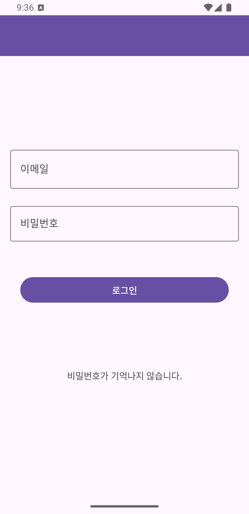 | 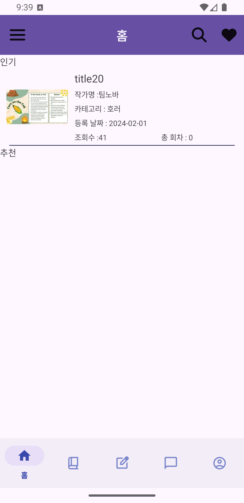 | 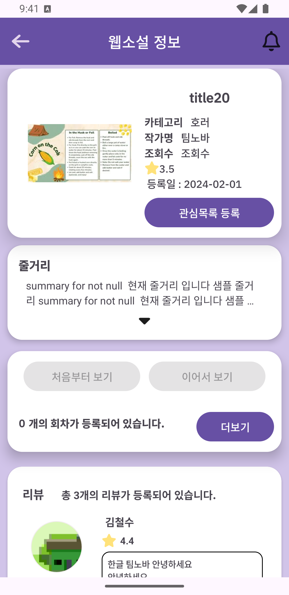 |

| 오픈 채팅방 목록 | 채팅 (Raw TCP) | 프로필 |
|---|---|---|
| 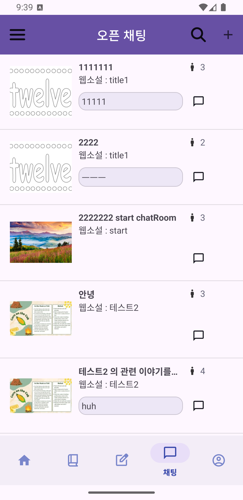 | 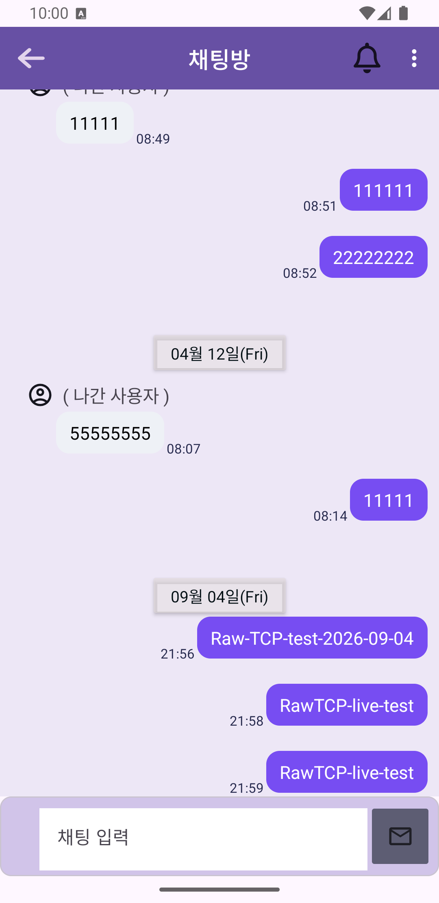 | 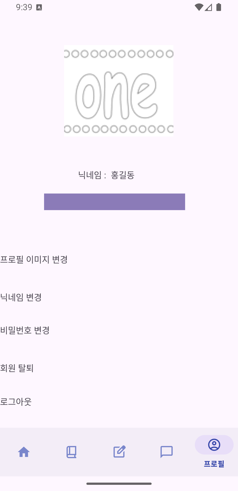 |

| 리뷰 작성 | 리뷰 목록 | 리뷰 상세 |
|---|---|---|
| 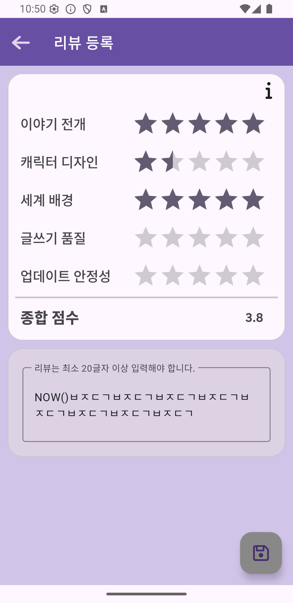 | 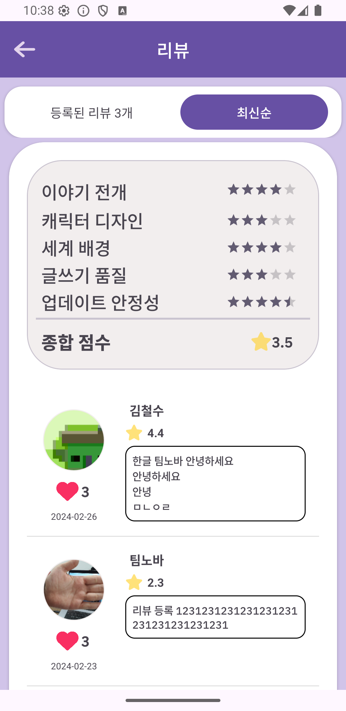 | 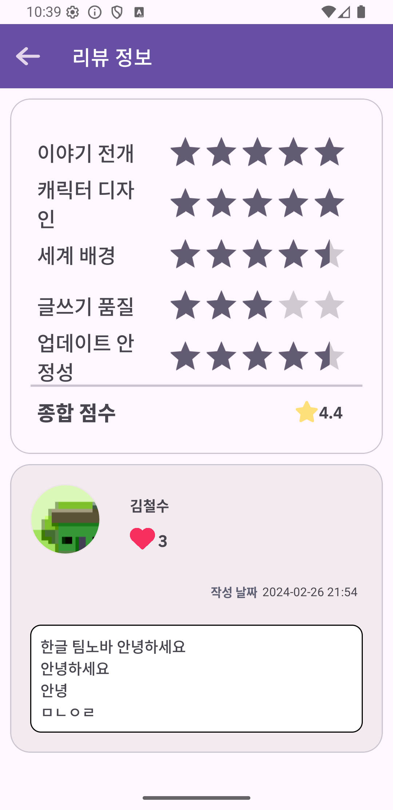 |

| 작품 등록 (작가 모드) | | |
|---|---|---|
| 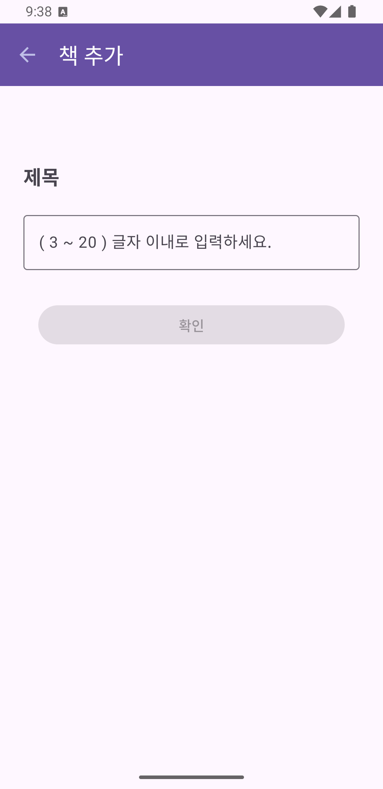 | | |

독자와 작가가 같은 앱을 씁니다. 작가 모드에서 작품을 등록하고 회차를 올립니다.
이 경로를 받는 서버 엔드포인트에는 인가 검사가 없었고([IDOR](https://github.com/rookieko/ourbook-server#1-작가-모드-3개-엔드포인트에-인가-검사가-없었다-idor)),
2026년 정리에서 소유권 검사를 넣었습니다.

채팅 화면의 아래 세 메시지는 **2026-09-04 에 실제로 주고받은 것**입니다. 그 위는 2024년 이력이고,
가운데 날짜 구분선이 둘을 나눕니다.

> 2026-09-04, Android API 36 에뮬레이터에서 실제 서버에 접속해 촬영했습니다.
> 프로필 화면의 이메일은 가렸습니다.

---

## 기술 스택

```text
언어/빌드   Java · Gradle 8.13 · AGP 8.13.2 · JDK 21 toolchain
SDK        minSdk 31 · targetSdk 34 · compileSdk 34
네트워크    Retrofit 2.9 + OkHttp 4.10 (Moshi / Gson 컨버터)
이미지      Glide 4.16
UI         Material 3 · ViewBinding · RecyclerView · Navigation
푸시        Firebase Cloud Messaging (BOM 32.7)
실시간      Raw TCP 소켓 (포트 6080) — 라이브러리 없이 직접 구현
```

화면(Activity) **39개** — `AppCompatActivity`/`Activity` 를 상속한 클래스 기준입니다.

---

## 기술적으로 볼 만한 것

### 1. Raw TCP 채팅 클라이언트

서버와 **개행 구분 JSON** 을 주고받습니다. Socket.IO 같은 라이브러리를 쓰지 않았으므로, 클라이언트 쪽에서도 직접 다뤄야 하는 것들이 있습니다.

- 소켓 수명과 Activity 생명주기의 분리
- `Ojwt-Token` 헤더로 받은 JWT를 소켓 접속 시에도 다시 제시
- 읽음 위치(`update_chat_id` / `refresh_chat_id`) 동기화
- 소켓이 끊긴 동안 온 메시지는 FCM 푸시로 수신

프로토콜 설계 자체는 서버 저장소 README에 자세히 적었습니다.

### 2. 읽기 위치 복원

회차를 읽다 나가면 다음에 그 위치부터 이어 봅니다. 스크롤 위치와 진행률을 서버에 올려 두고, 다시 들어올 때 모달로 확인한 뒤 복원합니다.

`ReadNovelActivity` 에서 세 가지를 맞춰야 했습니다.

- `onScrollChanged` 에서 스크롤 위치와 퍼센트를 갱신 (전체 높이가 0인 초기 프레임 방어)
- 복원은 `webNovelReadScroll.post { scrollTo(...) }` — **레이아웃이 끝난 뒤라야 스크롤이 먹습니다**
- `onPause()` 에서 저장 — 사용자가 뒤로 가기로 나가도 위치가 남습니다

### 3. 알림 권한 (API 33+)

`POST_NOTIFICATIONS` 를 선언하고 `ActivityResultContracts.RequestPermission` 으로 런타임 요청합니다. `Build.VERSION_CODES.TIRAMISU` 이상에서만 요청하고, 이미 허용돼 있으면 묻지 않습니다.

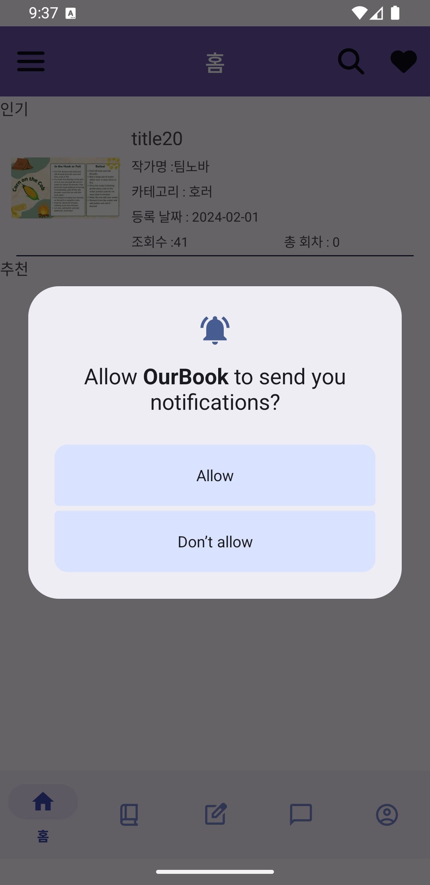

### 4. 리뷰·평점 — 다축 평가와 트리거 집계

한 편의 작품을 **다섯 축으로 나눠 평가**합니다 — 이야기 전개 · 캐릭터 디자인 · 세계 배경 ·
글쓰기 품질 · 업데이트 안정성. 종합 점수는 입력하는 게 아니라 다섯 축에서 계산돼 실시간으로 바뀝니다.

클라이언트가 붙는 엔드포인트는 7개이고, 화면은 세 개로 나뉩니다.

| 화면 | 하는 일 |
|---|---|
| `ReviewInputActivity` | 다축 평점 입력 · 재평가(수정) · 최소 20자 검증 |
| `CommentShowActivity` | 작품별 리뷰 목록 · 평점 통계 · 정렬 · 좋아요 |
| `ReviewInfoActivity` | 리뷰 상세 · 좋아요 토글 |

서버 쪽이 더 볼 만합니다. 다섯 축 점수와 본문이 **한 트랜잭션**으로 들어가고, 재평가는
`ON DUPLICATE KEY UPDATE` 로 덮어쓰며, 리뷰 좋아요 집계는 애플리케이션이 아니라
**DB 트리거**가 갱신합니다.

**좋아요는 평균 점수를 바꾸지 않습니다** — 트리거가 건드리는 것은 그 리뷰가 받은 좋아요 수뿐이고,
작품의 평균 점수는 저장돼 있지 않아 조회할 때마다 `AVG()` 로 다시 계산됩니다. 자세한 내용은
[서버 저장소](https://github.com/rookieko/ourbook-server#리뷰평점--다축-평가와-트리거-집계)에 적었습니다.

**작은 설계 판단 하나** — 리뷰 작성 버튼은 그 작품을 실제로 읽은 사람에게만 열립니다
(`BookInfoActivity` 가 「이어서 보기」 활성화 여부로 판단). 다만 이미 리뷰를 쓴 사람은
수정할 수 있어야 하므로 그 경우는 예외로 통과시킵니다.

---

## 실행 방법

**서버가 필요합니다.** [ourbook-server](https://github.com/rookieko/ourbook-server) 를 먼저 띄우세요.

### 1. 서버 주소 설정

저장소에는 실제 주소가 들어 있지 않습니다. 소스를 고칠 필요는 없고 `local.properties` 한 곳만 채우면 됩니다.

```bash
cp local.properties.example local.properties
```

```properties
ourbook.host=http://your-server-host.example.com/   # PHP REST API. 끝 슬래시 유지
ourbook.ip=203.0.113.10                             # Raw TCP 채팅 서버 (IP)
ourbook.port=6080
```

`local.properties` 는 `.gitignore` 에 있어 커밋되지 않습니다. 값은 `build.gradle.kts` 의 `buildConfigField` 를 거쳐 `BuildConfig` 로 들어가고, `BaseUrl` 과 `Constants` 가 그것을 참조합니다.

> **값을 빼거나 키를 틀려도 빌드는 성공합니다.** placeholder 로 APK 가 만들어질 뿐입니다.
> 앱은 뜨는데 로그인만 안 된다면 여기부터 확인하세요.

### 2. 빌드

```bash
./gradlew assembleDebug
```

**`google-services.json` 없이도 빌드됩니다.** FCM 플러그인은 해당 파일이 있을 때만 적용되도록 해 두었습니다 (`app/build.gradle.kts`). 푸시 알림을 쓰려면 Firebase 콘솔에서 받은 파일을 `app/google-services.json` 에 두세요.

---

## 알려진 한계 — "구현 완료"가 아닌 것들

**과장하지 않기 위해 명시합니다.**

### 라이브러리 탭은 동작하지 않습니다

하단 네비게이션에 항목은 있으나 `MainLoginActivity` 의 `setOnItemSelectedListener` 에 `R.id.tab_library` 분기가 없습니다. 탭해도 아무 일도 일어나지 않고 홈이 유지됩니다.

### 관심목록은 표시만 되고 등록·해제가 안 됩니다

작품 상세의 「관심목록 등록」 버튼은 **누를 수는 있지만 아무 일도 하지 않습니다.**
`BookInfoActivity` 에서 이 버튼이 등장하는 곳은 `:342` 한 줄뿐이고,
그것도 서버가 내려 준 현재 상태에 맞춰 **문구를 바꾸는 것**이 전부입니다.
`setOnClickListener` 가 없습니다.

읽기 경로만 살아 있어서 더 헷갈립니다 — 서버는 `LEFT JOIN likes` 로 관심 여부를 내려 주고
버튼 문구도 그에 따라 바뀌므로, **이미 등록된 작품은 「관심 해제」 라고 표시됩니다.**
그런데 그걸 눌러도 해제되지 않습니다.

서버에도 쓰기 경로가 없습니다(`INSERT INTO likes` · `DELETE FROM likes` 부재).
스키마는 오히려 더 나가 있어서 `likes.option` 에 *"1 = 알림 신청한 웹소설"* 까지 정의돼 있습니다.
**화면·스키마·읽기 쿼리까지 갖춰 놓고 쓰기만 빠진 상태**입니다.

기능별 CRUD 커버리지는 [서버 저장소](https://github.com/rookieko/ourbook-server#crud-로-본-기능)에 표로 정리했습니다.

### 작품 상세의 **조회수**가 채워지지 않습니다

**데이터는 정확히 쌓이고 있습니다.** DB 의 `increase_views` 트리거가 `history_view` 에
행이 들어갈 때마다 `webnovel.total_views` 를 올리고, **홈·탐색 목록 화면은 그 값을 그립니다.**
안 그리는 것은 작품 상세 화면 하나입니다.

바인딩 실수가 아니라 **구현하지 않은 것**입니다. `BookInfoActivity.java:208` 에
`// TODO 조회수 , 점수` 주석이 있고 `textViewViews` 를 설정하는 코드가 어디에도 없어,
레이아웃의 정적 라벨 "조회수" 가 그대로 보입니다.

같은 TODO 에 적힌 **평점은 이후에 구현됐습니다** — `textViewRating` 은 리뷰 응답의
`total_score` 로 채워집니다(2026-09-07 실행 확인: 3.5 표시). TODO 주석만 그대로 남아 있어
읽는 사람을 오해하게 만드는 쪽에 가깝습니다.

**리뷰 기능 자체는 동작합니다.** 리뷰 등록·목록·상세·좋아요·평점 통계는 모두 서버와 왕복합니다.
안 그려지는 것은 작품 상세 화면의 조회수 숫자 하나입니다.

### `ChatListenService` 는 프로토타입입니다

백그라운드 메시지 수신 서비스를 만들다 멈춘 상태입니다. **시작을 호출하는 곳이 없고**, 내부에서 `startListeningForMessages(null)` 을 호출합니다.

**채팅방 화면이 떠 있는 동안의 실시간 송수신은 동작합니다** (2026-09-04 실측). 그 외 상황에서는 FCM 푸시가 대신합니다. 백그라운드 소켓 유지는 미구현입니다.

### 자기가 보낸 메시지는 화면이 즉시 갱신되지 않습니다

전송은 성공하고 서버에 저장되지만(FCM 응답으로 확인), 보낸 사람의 RecyclerView 가 바로 갱신되지 않습니다. 방을 다시 들어가면 보입니다.

---

## 2026년 정리에서 고친 것

| 문제 | 처리 |
|---|---|
| API 33+ 에서 푸시 알림이 표시되지 않음 (`POST_NOTIFICATIONS` 미선언) | 선언 + 런타임 요청 추가 |
| 읽기 위치가 저장되지 않음 (`onScrollChanged` 가 값을 갱신하지 않음) | 갱신 로직 + `onPause()` 저장 + `post{}` 복원 |
| 릴리스 빌드에서도 요청/응답 본문 전체가 Logcat 에 남음 | `BuildConfig.DEBUG` 로 로깅 레벨 분기 |
| 로그인 시 응답 키를 전부 Logcat 에 출력하는 루프 | 제거 |
| `ChatListenService` 가 `exported="true"` | `false` 로 변경 |
| 서버 주소가 소스 두 곳에 하드코딩돼, 서버가 바뀔 때마다 소스를 고쳐 재빌드해야 함 | `local.properties` → `buildConfigField` → `BuildConfig` 주입으로 분리 |
| **리뷰 작성 화면 진입 즉시 크래시** — `Resources.getSystem().getString(R.string.tooltip_review)` 가 `Resources$NotFoundException` (`ReviewInputActivity.java:272`) | 죽은 호출 제거 |

마지막 항목은 이번 정리에서 **실행 검증 중에 찾았습니다.** `Resources.getSystem()` 은
프레임워크 리소스만 알아서 앱의 `R.string` 을 찾지 못합니다. 읽어온 값은 바로 다음 줄에서
하드코딩 문자열로 덮어써져 **쓰이지도 않았는데**, 그 한 줄 때문에 리뷰 작성 화면 전체가
열리지 않았습니다. 정적 분석으로는 안 걸리고 화면을 실제로 열어야 드러나는 종류입니다.
